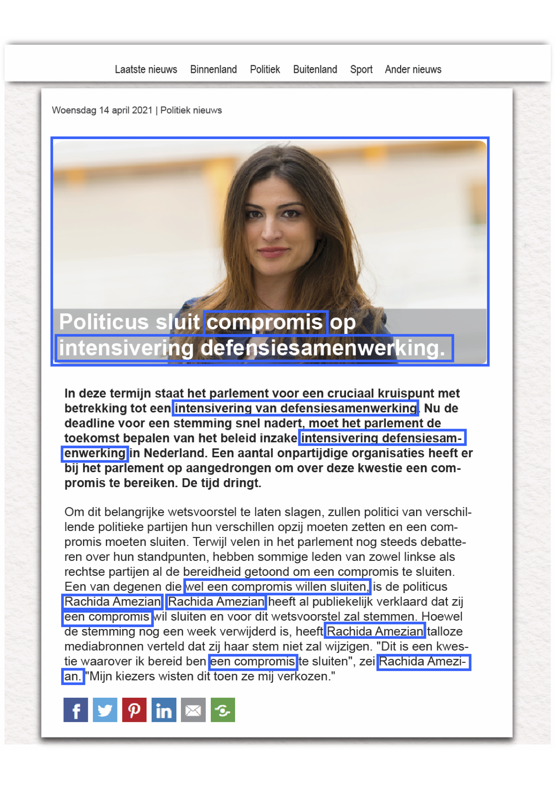

Pre-Analysis Plan
================
16 April 2021

# 1 Hypothesis

# 2 Research Desing and Protocol

## 2.1 Sample

I will conduct this survey experiment in the Netherlands in April
2021.  
Our sample, recruited through
[KiesKompas](https://www.kieskompas.nl/en/), will consist of 2,000
participants (based on the power analysis presented below) of 18 years
and older.  
The study has been approved by the [Research Ethics Review
Committee](https://fsw.vu.nl/nl/onderzoek/research-ethics-review/index.aspx)
of the *Vrije Universiteit Amsterdam* (see the approval
[here](../EthicalApproval.pdf).  
To ensure good quality of our data, two attention checks (discussed in
more detail below) are included.  
Each respondent failing the attention check will be excluded and
replaced with another ‘good’ response.

## 2.2 Experimental Protocol

The study is conducted online and in Dutch.  
Participants are told that they are taking part in a survey to get an
overview of how Dutch people form their views on politics. After reading
an informed consent message participants are forwarded to the main
questionnaire (or the survey will be terminated if they do not agree to
the consent form).

First, participants complete a set of background variables on their
stances on the political issues used in the experiment
(i.e. corona-measures, defense, education, immigration) and on their
attitude towards women in politics – the full codeboek can be viewed
[here](#).  
The pre-treatment block ends with one of the two attention checks
included in this survey. When participants fail this attention check, a
warning appears asking them to read the question again carefully and to
answer again.  
Only when they have answered it correctly, they enter the first round of
the experiment. After each round of the experiment, some filler
questions are asked about the respondents demographics. The stimuli in
the experiment are news messages in the same style as the Dutch news
website [nu.nl](https://www.nu.nl/). In these news messages, we
manipulate: a) the *gender* of the politician (male vs. female); b) the
*migration background* of the politician (based on a Arabic sounding
name (Rachid(a) Amezian) or a native Dutch sounding name (Karel/Karin
van der Kleijn)); and c) whether the politician *striked a compromise or
not*. This creates a full `2*2*2` factorial experiment with four
rounds.  
Every round, the news message covers a new issue.  
The issues are: “defense” (increase cooperation of the defense units),
“immigration” (immigration stop in western countries), “education”
(expansion creative elementary school activities), “COVID- 19”
(emergency legislation to combat COVID-19). For every round, the
politicians name, and thereby gender and immigration background, are
manipulated in the text and in the picture as well as the decision to
strike a compromise. For an illustration of the stimulus material, see
the Figure
below.

For every round, a title and a base sentence are constant across
conditions (see Figure 1 for an illustration of the stimulus material).
Each statement is introduced with a question: “What are the
consequences?” for certainty, “Is this preventable” for human control,
and “Who is responsible?” for responsibility. We have pretested the
statements for the vaccination, pesticides, painkiller and refugee
issues twice using convenience student samples (N 1 = 48, each statement
rated around 10 times; N 2 = 31, each statement rated around 15 times).
We adapted statements if nec- essary to ensure that they discriminated
clearly along the relevant appraisal dimensions.

## 2.3 Power Analysis

# 3 Measures

## 3.1 Dependent Variables

## 3.2 Control Variables

## 3.3 Attention Checks

## 3.4 Exclusion Criteria

# 4 Analysis

## 4.1 Hypothesis 1

## 4.2 Hypothesis 2

## 4.3 Hypothesis 3

# 5 Stimulus Material
