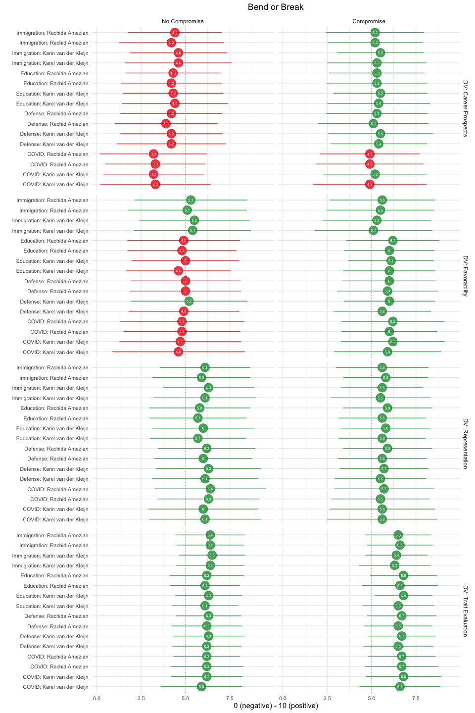
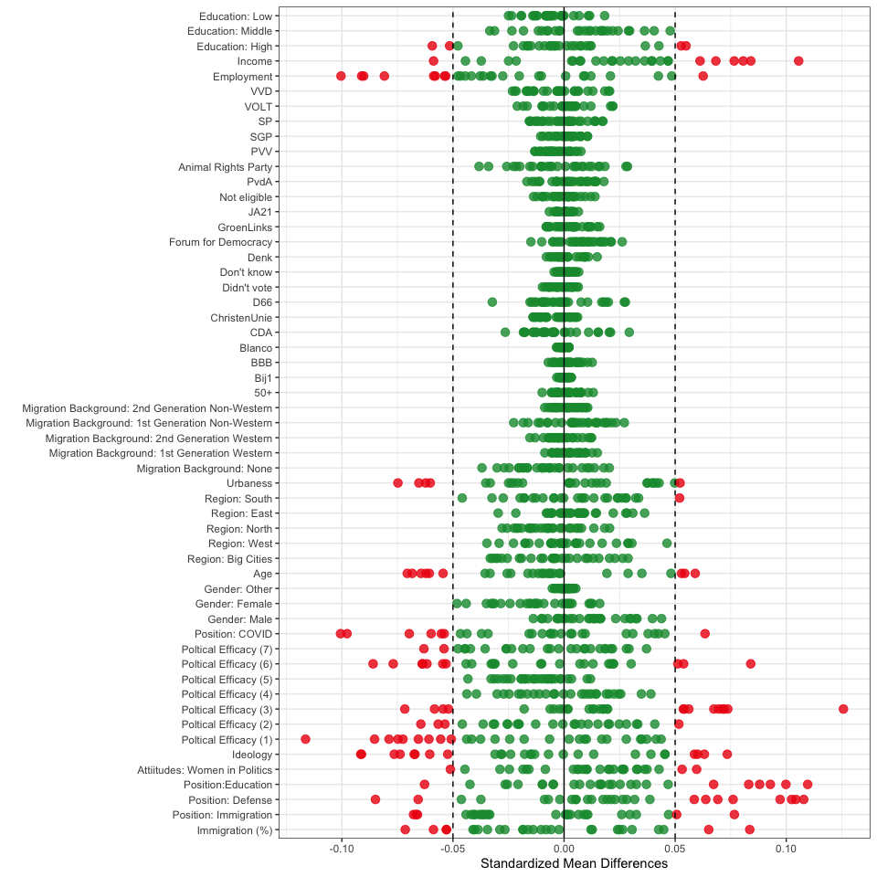
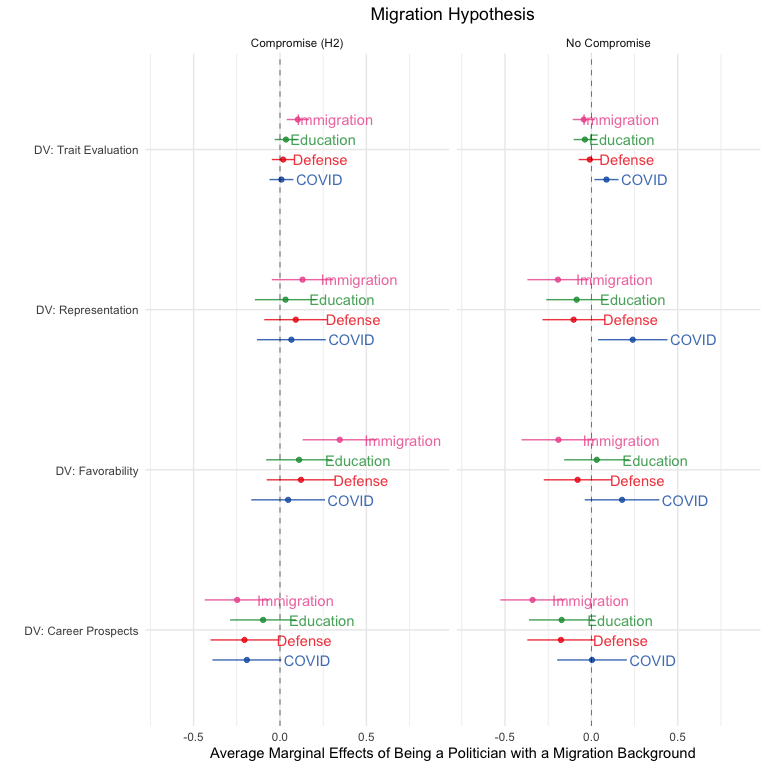
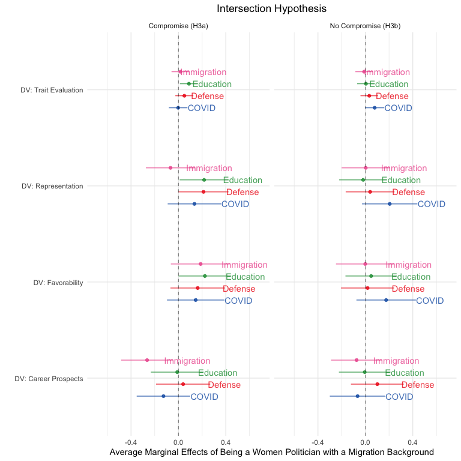
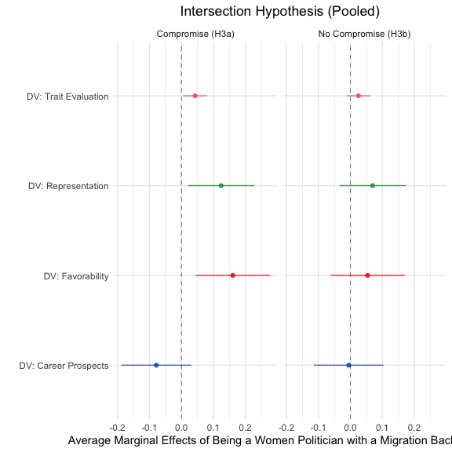

Analyses
================

# Scripts

  - [Required Packages &
    Reproducibility](#required-packages-&-reproducibility)
  - [Analyses](#analyses)
      - [Descriptive Results](#descriptive-results)
      - [Balance Checks](#balance-checks)
      - [Gender Hypothesis](#gender-hypothesis)
      - [Migration Hypothesis](#migration-hypothesis)
      - [Intersection Hypothesis](#intersection-hypothesis)
      - [Intersection Hypothesis –
        Pooled](#intersection-hypothesis--pooled)

# Required Packages & Reproducibility

``` r
rm(list=ls())
source(here::here("src/lib/functions.R"))
```

# Analyses

``` r
load(here("data/intermediate/cleaned_data.RData"))
source(here("src/analysis/scales.R"))
kable(scales, digits = 2) %>%
  kable_styling(full_width = F, position = "center")
```

<table class="table" style="width: auto !important; margin-left: auto; margin-right: auto;">

<thead>

<tr>

<th style="text-align:left;">

Variable

</th>

<th style="text-align:right;">

Cronbach’s Alpha

</th>

</tr>

</thead>

<tbody>

<tr>

<td style="text-align:left;">

DV: Trait Evaluation (Corona)

</td>

<td style="text-align:right;">

0.82

</td>

</tr>

<tr>

<td style="text-align:left;">

DV: Trait Evaluation (Defense)

</td>

<td style="text-align:right;">

0.82

</td>

</tr>

<tr>

<td style="text-align:left;">

DV: Trait Evaluation (Education)

</td>

<td style="text-align:right;">

0.84

</td>

</tr>

<tr>

<td style="text-align:left;">

DV: Trait Evaluation (Immigration)

</td>

<td style="text-align:right;">

0.83

</td>

</tr>

<tr>

<td style="text-align:left;">

Attitudes: Women in Politics

</td>

<td style="text-align:right;">

0.86

</td>

</tr>

<tr>

<td style="text-align:left;">

Political Efficacy

</td>

<td style="text-align:right;">

0.23

</td>

</tr>

</tbody>

</table>

``` r
source(here("src/analysis/data-for-analyses.R"))
```

## Check Missing Values

I employ the following criteria:

  - If 10% or less of the values on the dimension are missing, then we
    re-code the missing values to the overall mean.
  - If 11% or more of the values on the dimension are missing, then we
    re-code the missing values to a constant (for instance 0) and
    include a dummy variable indicating whether the response on the
    covariate was missing or not.

<!-- end list -->

``` r
descr <- d %>%
  summarise(`DV: Trait Evaluation` = round(sum(is.na(PT1))/n(),2),
            `DV: Favorability` = round(sum(is.na(PT2))/n(),2),
            `DV: Representation` = round(sum(is.na(PT3))/n(),2),
            `DV: Career Prospects` = round(sum(is.na(PT4))/n(),2),
            `Immigration (%)` = round(sum(is.na(PreT1))/n(),2),
            `Position: Immigration` = round(sum(is.na(PreT2))/n(),2),
            `Position: Defense` = round(sum(is.na(PreT3))/n(),2),
            `Position: Education` = round(sum(is.na(PreT4))/n(),2),
            `Attitude: Women in Politics` = round(sum(is.na(PreT5))/n(),2),
            `Ideology` = round(sum(is.na(PreT6))/n(),2),
            `Political Efficacy (1)` = round(sum(is.na(PreT7_1))/n(),2),
            `Political Efficacy (2)` = round(sum(is.na(PreT7_2))/n(),2),
            `Political Efficacy (3)` = round(sum(is.na(PreT7_3))/n(),2),
            `Political Efficacy (4)` = round(sum(is.na(PreT7_4))/n(),2),
            `Political Efficacy (5)` = round(sum(is.na(PreT7_5))/n(),2),
            `Political Efficacy (6)` = round(sum(is.na(PreT7_6))/n(),2),
            `Political Efficacy (7)` = round(sum(is.na(PreT7_7))/n(),2),
            `Position: COVID-19` = round(sum(is.na(PreT8))/n(),2),
            `Gender` = round(sum(is.na(F1))/n(),2),
            `Age` = round(sum(is.na(F2))/n(),2),
            `Region` = round(sum(is.na(F3))/n(),2),
            `Urbaness` = round(sum(is.na(F4))/n(),2),
            `Migration Background` = round(sum(is.na(F5))/n(),2),
            `Party Preference` = round(sum(is.na(F6))/n(),2),
            `Employment` = round(sum(is.na(F7))/n(),2),
            `Income` = round(sum(is.na(F8))/n(),2),
            `Education` = round(sum(is.na(F9))/n(),2)) %>%
  pivot_longer(cols = `DV: Trait Evaluation`:`Education`,
              names_to = "Variables", values_to = "% Missing Values") %>%
  filter(`% Missing Values` > 0) 

kable(descr) %>%
  kable_styling(full_width = F, position = "center")
```

<table class="table" style="width: auto !important; margin-left: auto; margin-right: auto;">

<thead>

<tr>

<th style="text-align:left;">

Variables

</th>

<th style="text-align:right;">

% Missing Values

</th>

</tr>

</thead>

<tbody>

<tr>

<td style="text-align:left;">

Urbaness

</td>

<td style="text-align:right;">

0.10

</td>

</tr>

<tr>

<td style="text-align:left;">

Party Preference

</td>

<td style="text-align:right;">

0.04

</td>

</tr>

<tr>

<td style="text-align:left;">

Employment

</td>

<td style="text-align:right;">

0.04

</td>

</tr>

<tr>

<td style="text-align:left;">

Income

</td>

<td style="text-align:right;">

0.12

</td>

</tr>

</tbody>

</table>

I recode the missing values of the variables `Urbaness`, `Party
Preference`, `Employment`, and `Income` to the mean value of the
respective variables – median for `Party Precerence`. For Income, I also
include a dummy indicating whether the missing value was imputed.

``` r
means <- d %>%
  summarise(F4 = round(mean(F4, na.rm = T),0),
            F5 = round(mean(F5, na.rm = T), 0),
            F6 = max(names(table(F6))),
            F7 = round(mean(F7, na.rm = T),0),
            F8 = round(mean(F8, na.rm = T),0),
            F9 = round(mean(F9, na.rm = T),0))

d <- d %>%
  mutate(F4 = replace_na(F4, means$F4),
         F5 = replace_na(F5, means$F5),
         F6 = replace_na(F6, means$F6),
         F7 = replace_na(F7, means$F7),
         missing_F8 = if_else(is.na(F8), 1, 0),
         F8 = replace_na(F8, means$F8),
         F9 = replace_na(F9, means$F9))
rm(means, descr, scales)
```

Next, we automatically extract a `.md` file for the online appendix, as
well as a latex table for the manuscript. We are using jinja2 template
[src/analysis/table\_descriptives.tex.j2](table.tex.j2) which is called
with a json string containing the data. To replicate, make sure
`env/bin/pip install -U j2cli` is installed via your command line.

``` r
source(here("src/analysis/descriptive-information-overview.R"))
table2 <- knitr::kable(descr, digits=2)
fn <- here("report/figures/table_descriptives.tex")
cat("# Table: Descriptive Information of Variables under Study \n\n", file=fn)
cat(table2, file=fn, sep="\n", append=T)

methodnames <- setNames(as.list(descr$name), descr$name)
table <- purrr::map(descr, .f= ".") 
#render_j2("src/analysis/table_descriptives.tex.j2", "report/figures/table_descriptives.tex", data=list(data=table, methods=methodnames)
rm(descr, methodnames, table, fn, table2)
```

## Descriptive Results



## Balance Checks

The figure below shows that the data is unbalanced for the variables:
`Income`, `Employment`, `Urbaness`, `Age`, `Position: COVID`, `Political
Efficacy`, `Ideology`, `Attitudes: Women in Politics`, `Position:
Education`, `Position: Defense`, `Position: Immigration`. As described
in the Pre-Analysis Plan (p.10), I will add these covariates to the
analyses as controls.

``` r
source(here("src/analysis/balance-test.R"))
df
```



``` r
source(here("src/analysis/distribution_unbalanced_vars.R"))

p1 + p2 + p3 + p4 + plot_layout(ncol=2)
```


## Gender Hypothesis

``` r
source(here("src/analysis/h1.R"))
h1
```


## Migration Hypothesis

``` r
source(here("src/analysis/h2.R"))
h2
```



## Intersection Hypothesis

``` r
source(here("src/analysis/h3.R"))
h3
```



## Intersection Hypothesis – Pooled

``` r
source(here("src/analysis/h3-pooled.R"))
h3p
```



## Exploration
